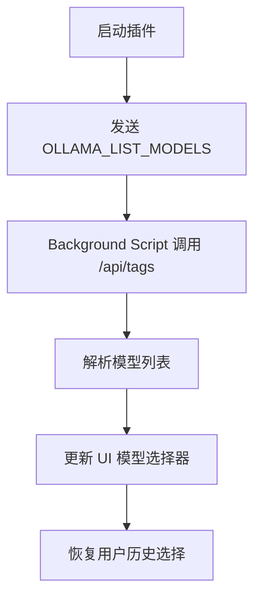
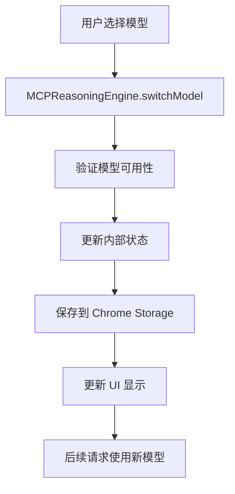

# 🤖 Ollama 模型切换功能演示

## 功能概述

本插件现在支持动态切换 Ollama 模型，让用户可以在不同的 AI 模型之间无缝切换，体验不同模型的特色和能力。

## ✨ 新增功能

### 1. 自动模型检测

- 🔍 **自动扫描**: 启动时自动检测 Ollama 中所有可用模型
- 📊 **详细信息**: 显示模型大小、参数量、模型族等信息
- 🔄 **手动刷新**: 支持手动刷新模型列表

### 2. 智能模型切换

- 🎯 **下拉选择**: 直观的模型选择器界面
- 💾 **记忆选择**: 自动保存用户的模型偏好
- ⚡ **即时切换**: 无需重启插件，立即生效

### 3. 模型状态显示

- 📱 **状态栏**: 实时显示当前使用的模型
- 🏷️ **模型标签**: 包含模型名称和参数信息
- 🎨 **视觉反馈**: 清晰的 UI 指示

## 🚀 使用方法

### 步骤 1: 准备多个模型

```bash
# 安装不同的模型进行测试
ollama pull deepseek-r1:1.5b
ollama pull llama3.2:3b
ollama pull qwen2.5:7b
ollama pull mistral:7b

# 启动 Ollama 服务（支持 CORS）
OLLAMA_ORIGINS="*" ollama serve
```

### 步骤 2: 打开插件

1. 点击浏览器中的插件图标
2. 侧边栏会显示当前模型状态
3. 查看"🤖 选择模型"部分

### 步骤 3: 切换模型

1. 在模型选择器中选择不同的模型
2. 观察状态栏中模型名称的变化
3. 系统会自动保存你的选择

### 步骤 4: 测试不同模型

使用"模型自介绍"按钮测试不同模型的响应风格：

- **deepseek-r1:1.5b**: 专业的推理模型
- **llama3.2:3b**: 通用对话模型
- **qwen2.5:7b**: 中文优化模型
- **mistral:7b**: 欧洲开源模型

## 🎯 应用场景

### 1. 模型性能对比

```
场景: 复杂推理任务
- 切换到 deepseek-r1:1.5b: 专业推理
- 切换到 qwen2.5:7b: 中文理解
- 切换到 llama3.2:3b: 通用对话
```

### 2. 特定任务优化

```
数学计算: deepseek-r1:1.5b
中文对话: qwen2.5:7b
代码生成: llama3.2:3b
创意写作: mistral:7b
```

### 3. 资源管理

```
低资源环境: 选择小参数模型 (1.5b-3b)
高精度需求: 选择大参数模型 (7b+)
快速响应: 选择轻量模型
```

## 📊 技术实现

### 模型检测流程



### 模型切换流程



## 🔧 API 接口

### 获取模型列表

```typescript
chrome.runtime.sendMessage({ type: 'OLLAMA_LIST_MODELS' });
// 返回: { success: true, models: OllamaModel[] }
```

### 切换模型

```typescript
await reasoningEngine.switchModel(modelName);
// 自动保存到存储并更新状态
```

### 恢复模型选择

```typescript
await reasoningEngine.restoreModelChoice();
// 从 Chrome Storage 恢复用户偏好
```

## 🎁 用户体验特性

### 1. 智能默认值

- 首次使用：自动选择 `deepseek-r1:1.5b`
- 后续使用：记住上次选择的模型

### 2. 友好的错误处理

- 模型不可用时显示清晰错误信息
- 自动回退到可用模型
- 网络错误时的重试机制

### 3. 实时反馈

- 模型切换时的即时确认
- 加载状态的可视指示
- 详细的操作日志

## 🔮 未来扩展

### 计划功能

- [ ] 模型性能监控（响应时间、质量评分）
- [ ] 智能模型推荐（基于任务类型）
- [ ] 模型使用统计和分析
- [ ] 自定义模型配置和参数调整
- [ ] 多模型并行推理和结果对比

### 技术优化

- [ ] 模型预热机制
- [ ] 缓存优化
- [ ] 批量请求支持
- [ ] 流式响应优化

---

**🎉 现在你可以在一个插件中体验多个 AI 模型的强大能力！**
